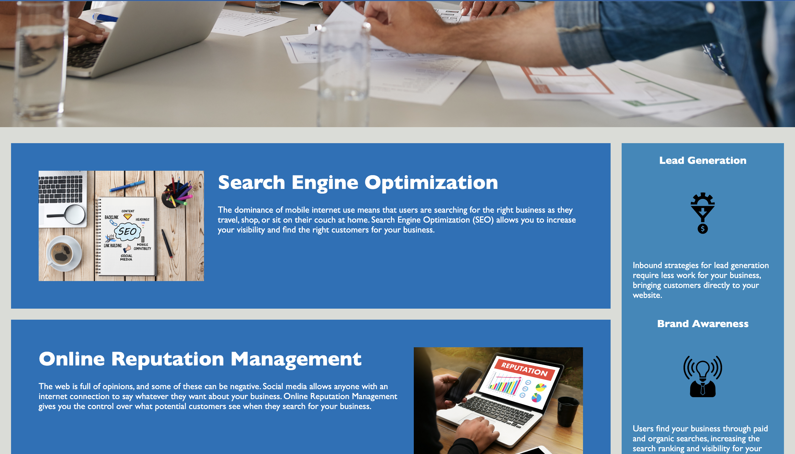
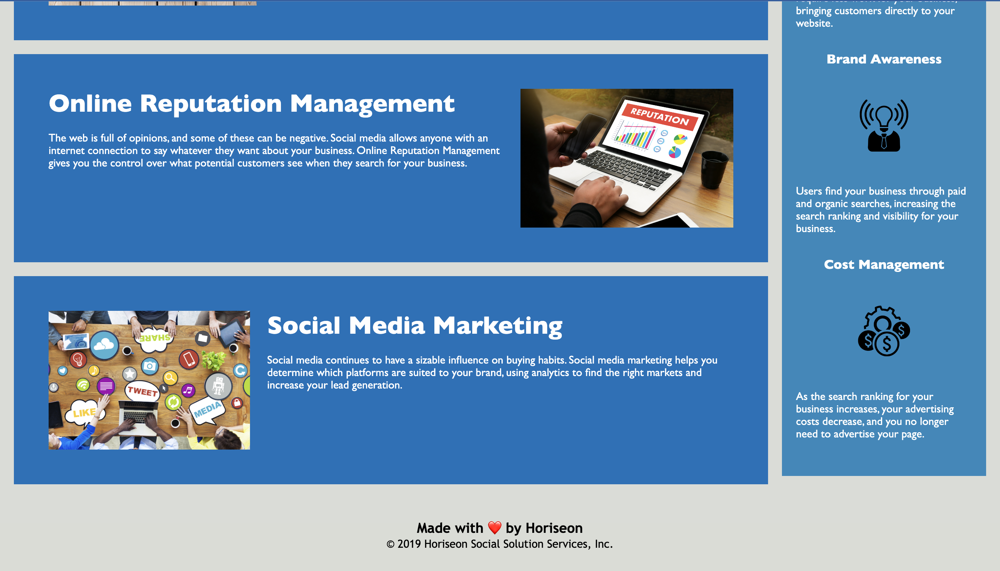

# horiseon-accessibility

## Description

This project was created for adding accessibility elements/features to Horiseon website.
As part of this project all non semantic elements are converted to semantic elements such as header,nav, section,article ,aside, footer etc. Alternative texts are added to all image elements. As part of the code reusability class names are made unique and reused.Css selectors and properties are organized and consolidated.

## Installation

N/A

## Usage

There are mainly 3 sections in this website. Search engine optimization, online reputation management and social media marketing which can be accessed through the navigation links at the top.
Search engine optimization talks about increasing website's visibility to the right users.
Online reputation management put some control over content that customers can see when they search for business. Finally the social media marketing describes how to increase lead generation using different types of social media platforms. 

Benefits are displayed at the right side of the page which are lead generation, brand awareness and cost management.

The following images show the web application's appearance and functionality   :

Link to website  :

https://shimna-puthanayil.github.io/horiseon-accessibility/

## Credits

References

https://www.w3schools.com/html/html5_semantic_elements.asp

https://developer.mozilla.org/en-US/docs/Learn/Accessibility/CSS_and_JavaScript

https://developer.mozilla.org/en-US/docs/Learn/CSS/Building_blocks/Organizing

https://blog.hubspot.com/marketing/image-alt-text

## License

MIT license.
